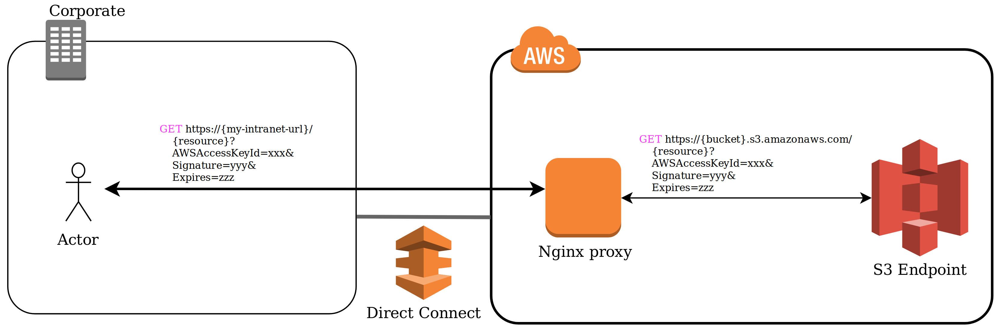

[](https://github.com/fartbagxp/blob/master/LICENSE.md)
[](https://circleci.com/gh/fartbagxp/s3-proxy)

# Overview

This is an nginx proxy that proxies large binary data (ex. PDFs) from an S3 bucket.

Provided a S3 bucket (private or public), the proxy is used to simply re-route the URL (via proxy_pass) to the S3 bucket resource.

The proxy route all requests to a specific path on a S3 bucket, defined by `NGINX_S3_BUCKET` (such as `http://<xxx>.s3-website-us-east-1.amazonaws.com/`).

For simplicity, this is one way it can look like:
<p align="center">

</p>

AWS has a more [extensive architectural diagram](https://aws.amazon.com/answers/networking/accessing-vpc-endpoints-from-remote-networks/) of what this can look like, without a reverse proxy.

## Setup

To try this out locally, you should have the following:

* A presigned URL for a AWS S3 resource.
* Certificates and Keys for SSL, and a Diffie–Hellman key for forward secrecy (use the config folder ones for local development, if you're too lazy to generate one).
* [Docker](https://www.docker.com/) (optional)

### Configuration

Configuration is handled by environment variables. The following variables are available:

* `NGINX_SERVER_NAME`: The port in which this nginx proxy is listening to
* `NGINX_S3_BUCKET`: The S3 bucket URL where the the resources are stored - (ex. `http://<xxx>.s3-website-us-east-1.amazonaws.com/`)
* `NGINX_SSL_CERT_PATH`: The SSL certificate to identify the server
* `NGINX_SSL_KEY_PATH`: The private key for the server for encrypting traffic between the server and client.
* `NGINX_SSL_DH_PATH`: The Diffie–Hellman key for generating session keys for perfect forward secrecy. 
* `NGINX_DNS_IP_1`: The primary DNS resolver to use
* `NGINX_DNS_IP_2`: The secondary DNS resolver to use (in case the first one fails)

### Presign URL for AWS S3 resources

The normal use case is that a presigned URL will be generated so that the proxy does not need to know anything about authentication with AWS.

By default, the presign URL expires in an hour.

```sh
aws s3 presign s3://mybucket/myobject
```

This will generate a URL that will expire in 300 seconds.

```sh
aws s3 presign s3://mybucket/myobject --expires-in 300
```

* Note: The maximum time you can set a [presign URL for expiration parameter](https://docs.aws.amazon.com/AmazonS3/latest/API/sigv4-query-string-auth.html) is 7 days.

### Generated keys and certs

* To generate a 2048-bit private key and a self-signed certificate, simply run

```sh
openssl req -newkey rsa:2048 -nodes -keyout config/domain.key -x509 -days 365 -out config/domain.crt
```

The `domain.crt` and `domain.key` files will appear in your directory.

* To generate a Diffie-Hellman (DH) key for TLS, run this.

```sh
openssl dhparam -out config/dhparam.pem 4096
```

### Building the configuration

There is a `build.sample.sh` script used for building the `nginx.conf` file.

Essentially, it replaces all the [Nginx](https://www.nginx.com/) configuration.

```sh
cp build.sample.sh build.sh
```

* Modify build.sh with your environment variables.

```
sh build.sh
```

The `nginx.conf` will appear in the local directory.

## Deployment

### Local

For local deployment, I simply use a slim [Docker](https://www.docker.com/) image for mostly testing purposes.

Here's a quick and dirty script for testing (using port in build.sample.sh).

```sh
sh build.sh
docker run --name nginx-s3-proxy \
    -p 3000:80 \
    -p 443:443 \
    -v ${PWD}/nginx.conf:/etc/nginx/nginx.conf \
    -v ${PWD}/config/domain.crt:/etc/nginx/domain.crt \
    -v ${PWD}/config/domain.key:/etc/nginx/domain.key \
    -v ${PWD}/config/dhparam.pem:/etc/nginx/dhparam.pem \
    -d nginx:1.13.12-alpine
```

At this point, you should be able to go to `localhost:3000`, it'll automatically redirect you to `https://localhost`, in which if you accept your own self-signed certificate, you will get an Access Denied message.

Append the [AWS S3 resource URL](https://docs.aws.amazon.com/cli/latest/reference/s3/presign.html) from the presign URL `localhost:3000/<resource>` to get to your file.

## Other Considerations

One consideration to fetching data from a private AWS S3 bucket is to use [AWS API Gateway](https://docs.aws.amazon.com/apigateway/latest/developerguide/integrating-api-with-aws-services-s3.html) for proxying the HTTP request.

The API gateway can act as either a HTTP proxy or a [AWS Lambda](https://aws.amazon.com/lambda/) proxy.

It can provide a URL that can integrate a GET `https://your-api-host/stage/` request with the backend GET `https://your-s3-host/`.

Managed service means scaling is done by AWS automatically.

The major drawback of this approach is the [limitation of API Gateway Integration](https://docs.aws.amazon.com/apigateway/latest/developerguide/limits.html) with HTTP proxy and [AWS Lambda](https://aws.amazon.com/lambda/). The integration timeout is currently set to 30 seconds.

To download a 1GB binary file, one would need to hit slightly higher than 286.4Mbps to download the file before the timeout.

## Troubleshooting

* "SignatureDoesNotMatch" error appears as the response when you try to hit the server.

    The bucket name is currently set to an non-existent bucket, so please make sure to check that environment variable before proceeding.